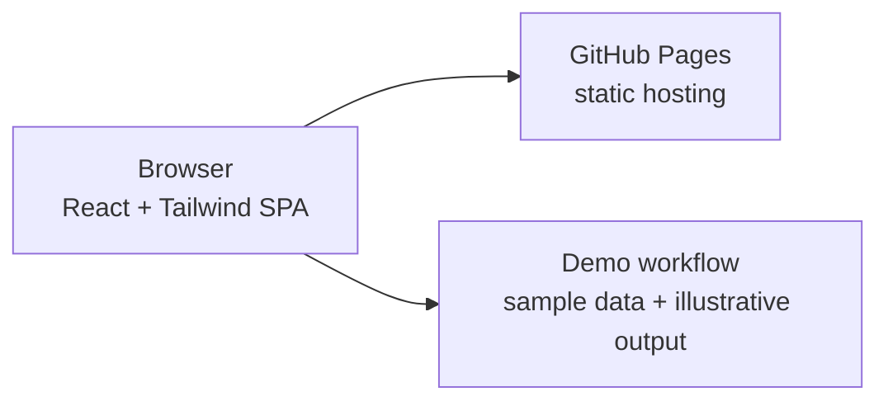

<div align="center">


# Calisto · OcuVision AI

### Public demo · AI-assisted retinal fundus screening interface

[](https://fahmiimrann.github.io/calisto.github.io/)
[](https://fahmiimrann.github.io/calisto.github.io/)


</div>

---

> ### 🔎 Demo notice
> This is the **public demo** of Calisto (OcuVision AI). It exists for **demonstration, portfolio, and academic observation only** — to show the interface, workflow, and concept.
> It uses **sample/demo data only** and is **not** connected to any real patient records, production database, or clinical backend. Please do not enter real patient information.

---

## Overview

**Calisto (OcuVision AI)** is a web-based interface that demonstrates how an AI-assisted **retinal fundus screening** workflow could look and feel — from uploading a fundus image, to a preliminary screening result, to patient-record management and analytics — all inside a clean single-page dashboard.

This repository powers the public demo site and is intended purely for **public observation**. It is **not** a clinical or production healthcare system.

> ⚠️ **Medical disclaimer:** Calisto is a concept/prototype and a decision-support demonstration only. It is **not** a certified or regulatory-cleared medical device and must never be used for real diagnosis or treatment. Any real screening must be performed and confirmed by a qualified ophthalmologist.

<div align="center">

### 👉 [Open the live demo](https://fahmiimrann.github.io/calisto.github.io/)

</div>

---

## ✨ What it demonstrates

| | Module | What you can explore |
|---|---|---|
| 📊 | **Overview** | An at-a-glance dashboard summarising scans, anomalies flagged, cases reviewed, and AI-related metrics. |
| 🔬 | **Diagnostics** | The fundus-image upload and AI screening workflow, with a results report and feature breakdown. |
| 🗂️ | **Patient Registry** | A patient-record workflow using condition-coded IDs (`OCU-DR`, `OCU-G`, `OCU-AMD`, `OCU-H`). |
| 📈 | **Insights** | Case mix, age distribution, and gender split visualised with interactive charts. |
| ⚙️ | **Settings** | Account preferences, device-link labelling, and the AI-model management interface. |

---

## 🧠 Conditions represented

| Condition | Severity tier (demo) | Record prefix |
|---|---|---|
| Diabetic Retinopathy | Critical / Alert | `OCU-DR` |
| Glaucoma (incl. early indicators) | Moderate–Critical | `OCU-G` |
| Age-related Macular Degeneration (AMD) | Moderate | `OCU-AMD` |
| Healthy / Normal | Optimal | `OCU-H` |

---

## 🤖 About the AI in this demo

The screening output shown in the public demo is illustrative and meant to communicate the **concept and workflow** rather than provide a clinical result. Trained model weights, private inference services, and any real patient data are **not** part of this public repository.

The underlying codebase is structured to support different inference engines in private/local setups, but the public demo intentionally keeps everything to safe, non-sensitive sample behaviour.

---

## 🏗️ How the demo is built



The demo is a **static single-page app** served by **GitHub Pages**. Everything you see runs in the browser against demo/sample data — there is no real backend, database, or patient storage behind the public site.

---

## 🛠️ Tech stack

- **Frontend:** React 18 (via Babel standalone), Tailwind CSS, Chart.js, Font Awesome, Plus Jakarta Sans
- **Hosting:** GitHub Pages (static frontend)
- **Data (demo):** In-browser sample/demo data only

---

## 🚀 Try it

No installation required — just open the live demo:

**➡️ https://fahmiimrann.github.io/calisto.github.io/**

### Run the interface locally (optional)

Because the public demo is a static page, you can preview it with any simple static server:

```bash
# 1. Clone the repository
git clone https://github.com/fahmiimrann/calisto.github.io.git
cd calisto.github.io

# 2. Serve it locally (choose any one)
python -m http.server 3000
#   or
npx serve .
```

Then open **http://localhost:3000** in your browser.

> This local preview shows the **demo interface only**. It is not wired to any real backend, database, or AI service.

---

## 📁 Project structure (demo)

```
calisto.github.io/
├── index.html            # Single-page React frontend (the whole demo UI)
├── Calisto Logo.png      # Branding
├── Background_Video.mp4  # Login backdrop
└── README.md
```

---

## 🗺️ Roadmap (demo scope)

- [ ] Exportable sample PDF reports
- [ ] Multi-language interface
- [ ] Additional demo condition examples
- [ ] Accessibility polish (keyboard + screen-reader passes)

---

## 📄 License

Released under the **MIT License**. Provided for demonstration and educational purposes only.

<div align="center">

Built with care to demonstrate accessible eye-health screening · **[Open Calisto →](https://fahmiimrann.github.io/calisto.github.io/)**

</div>
