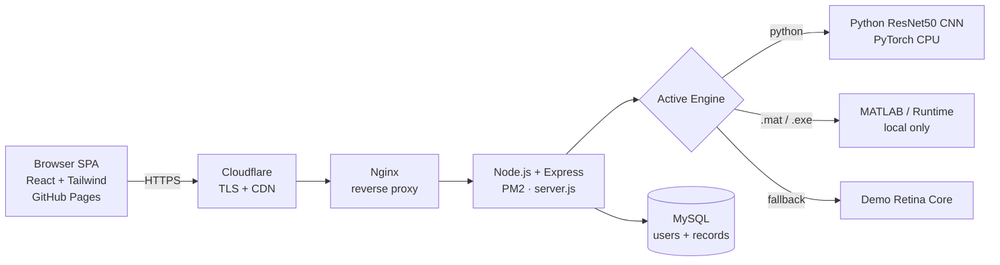

<div align="center">


# Calisto · OcuVision AI

### Premium Ophthalmic Intelligence — AI-powered retinal fundus screening in your browser

[](https://fahmiimrann.github.io/calisto.github.io/)
[](https://fahmiimrann.github.io/calisto.github.io/)


</div>

---

## Overview

**Calisto (OcuVision AI)** is a production, web-based screening platform that analyzes **retinal fundus images** and flags signs of common eye diseases in seconds. It pairs a polished, glassmorphic single-page dashboard with a real AI inference backend.

The **live deployment** runs the **Python End-to-End ResNet50 CNN** on an always-on cloud server (AWS EC2 → Nginx → PM2-managed Node.js, behind Cloudflare HTTPS), backed by a shared **MySQL** database. The same codebase can also run a **MATLAB Bagged Trees** classifier locally, and ships with a deterministic demo engine as a graceful fallback. Each scan returns genuine feature extraction (GLCM texture, intensity statistics, vessel morphology, optic-nerve-head cup-to-disc ratio) alongside the disease classification.

> ⚠️ **Medical disclaimer:** Calisto is a decision-support and screening aid, **not** a certified or regulatory-cleared medical device. It must not be used as the sole basis for diagnosis or treatment. All findings require confirmation by a qualified ophthalmologist.

<div align="center">

### 👉 [Launch the live app](https://fahmiimrann.github.io/calisto.github.io/)

</div>

---

## ✨ Key Features

| | Module | What it does |
|---|---|---|
| 📊 | **Overview** | At-a-glance dashboard — scans today, anomalies detected, cases reviewed, and live AI-accuracy metrics. |
| 🔬 | **Diagnostics** | Upload a fundus image and run AI screening; per-scan engine picker (MATLAB / Python / Demo) with rich feature breakdowns. |
| 🗂️ | **Patient Registry** | Full CRUD on patient records with condition-coded IDs (`OCU-DR`, `OCU-G`, `OCU-AMD`, `OCU-H`) and password-protected edits/deletes. |
| 📈 | **Insights** | Analytics on case mix, age distribution, and gender split rendered with Chart.js. |
| ⚙️ | **Settings / AI Core** | Manage your staff account, link a local device, configure data privacy, and upload / activate AI models. |

---

## 🧠 Conditions Detected

| Condition | Severity tier | Record prefix |
|---|---|---|
| Diabetic Retinopathy | Critical / Alert | `OCU-DR` |
| Glaucoma (incl. early indicators) | Moderate–Critical | `OCU-G` |
| Age-related Macular Degeneration (AMD) | Moderate | `OCU-AMD` |
| Healthy / Normal | Optimal | `OCU-H` |

---

## 🤖 AI Engines

Calisto can route each scan to one of three interchangeable engines:

| Engine | Type | Notes |
|---|---|---|
| **Python ResNet50 CNN** ⭐ | `python_predict.py --engine cnn` | End-to-end deep-learning classifier — **the engine running in production**. |
| **MATLAB Bagged Trees** | `99_BaggedTreesModel.mat` | Full feature pipeline; runs via MATLAB or a licence-free compiled `.exe` + MATLAB Runtime (local environments). |
| **Demo Retina Core** | built-in | Deterministic baseline used as a fallback when no inference runtime is reachable — keeps the public site fully interactive. |

---

## 🏗️ Architecture



The browser app talks to the backend through `API_BASE_URL`. In production it reaches the live CNN backend; if that backend is unreachable it gracefully degrades to the demo engine, so the GitHub Pages site always loads.

---

## 🛠️ Tech Stack

- **Frontend:** React 18 (via Babel standalone), Tailwind CSS, Chart.js, Font Awesome, Plus Jakarta Sans
- **Backend:** Node.js, Express, Multer (uploads), CORS, dotenv
- **AI:** Python (ResNet50 CNN, PyTorch) in production · MATLAB Bagged Trees / Compiler Runtime for local runs
- **Data:** MySQL (production single source of truth) · Supabase or local JSON supported as alternatives
- **Infrastructure:** AWS EC2 (Ubuntu) · Nginx reverse proxy · PM2 process manager · Cloudflare (TLS/CDN)
- **Hosting:** GitHub Pages (frontend) + EC2 (backend API)

---

## 🔒 Security

Production hardening built into the backend:

| Area | Measure |
|---|---|
| Passwords | Hashed with **scrypt** (salted, constant-time compare); never stored or returned in plaintext. Legacy records auto-upgrade on next login. |
| Transport | **HTTPS everywhere** via Cloudflare TLS + **HSTS**; backend trusts the proxy chain for correct client IPs. |
| Brute force | **Rate limiting** on `/api/login` and `/api/register` (per-IP). |
| Headers | `X-Content-Type-Options`, `X-Frame-Options`, `Referrer-Policy`, `Permissions-Policy`; `X-Powered-By` disabled. |
| Uploads | Image-only filter, **15 MB** size cap, single-file, in-memory (no disk persistence of raw uploads beyond transient inference). |
| Access control | Bearer-token sessions; destructive record actions require password re-verification. |
| CORS | Strict allow-list of trusted origins (configurable via `EXTRA_CORS_ORIGINS`). |
| Secrets | Credentials kept in a git-ignored `.env`; database reachable only over localhost / SSH tunnel. |

---

## 🚀 Getting Started (Local)

### Use the live app
No installation required — just open **[the live site](https://fahmiimrann.github.io/calisto.github.io/)**. It connects to the production backend and runs the real **Python ResNet50 CNN** (first scan after an idle period takes ~25–30 s while the model warms up on CPU).

### Run locally with the AI backend

```bash
# 1. Clone the repository
git clone https://github.com/fahmiimrann/calisto.github.io.git
cd calisto.github.io

# 2. Install backend dependencies
npm install

# 3. (Optional) configure your environment
#    Create a .env file – see the variables below.

# 4. Start the server
npm start
```

Then open **http://localhost:3000** to use the site against your local backend.

### Environment variables (`.env`)

```env
PORT=3000

# Storage — choose ONE backend:
# (a) MySQL (production single source of truth)
DB_BACKEND=mysql
MYSQL_HOST=127.0.0.1
MYSQL_PORT=3306
MYSQL_USER=myvision-db
MYSQL_PASSWORD=your-password
MYSQL_DATABASE=myvision-db

# (b) Supabase
# SUPABASE_URL=https://yourproject.supabase.co
# SUPABASE_SERVICE_KEY=your-service-key
# (c) Local JSON files (default if neither above is set)

# AI runtime
# Python CNN (production): point to the venv interpreter + models dir
# OCU_PYTHON_EXEC=/path/to/python/.venv/bin/python
# OCU_MODELS_DIR=/path/to/models
# …or MATLAB locally (licence-free compiled exe, or full MATLAB):
# OCU_COMPILED_EXE=C:\path\to\dist\ocu_main.exe
# MATLAB_EXEC=C:\Program Files\MATLAB\R2025b\bin\matlab.exe

# Extra CORS origins (comma-separated), e.g. your GitHub Pages URL
# EXTRA_CORS_ORIGINS=https://fahmiimrann.github.io
```

> To develop locally against the shared production MySQL, open an SSH tunnel to the
> database first (e.g. `db-tunnel.ps1`) so it stays the single source of truth.

Verify the backend at **http://localhost:3000/api/health**.

---

## 📡 API Reference (selected)

| Method | Endpoint | Description |
|---|---|---|
| `GET` | `/api/health` | Backend + runtime status |
| `POST` | `/api/analyze` | Run AI screening on an uploaded fundus image |
| `POST` | `/api/login` · `/api/register` · `/api/logout` | Authentication |
| `GET` `POST` `PATCH` `DELETE` | `/api/records` | Patient record CRUD (auth required) |
| `GET` `POST` | `/api/models` · `/api/models/select` | AI model registry |

---

## ☁️ Deployment

- **Frontend:** published automatically to **GitHub Pages** at the live URL above on every push to `main`. The live site points at the production backend via `TUNNEL_API_BASE_URL` in `index.html`; if that's blank or unreachable, it falls back to the demo backend so the page always works.
- **Backend:** runs on **AWS EC2 (Ubuntu)** as an always-on service:
  - **Nginx** reverse-proxies the API domain to the Node app.
  - **PM2** keeps `server.js` alive and restarts it on boot.
  - **Cloudflare** terminates TLS and fronts the domain (HTTPS + CDN).
  - **Python venv (PyTorch, CPU)** serves the ResNet50 CNN; a swap file covers the model's peak memory on small instances.
  - **MySQL** stores users and patient records (schema auto-creates and seeds on first boot).

---

## 📁 Project Structure

```
calisto.github.io/
├── index.html            # Single-page React frontend (the whole UI)
├── server.js             # Express API + static file server
├── matlab-runner.js      # MATLAB / compiled-exe inference bridge
├── python-runner.js      # Python CNN inference bridge
├── db.js                 # MySQL / Supabase / local-JSON data layer
├── python/               # Inference + training scripts (ResNet50, U-Net, features)
├── models/               # Trained weights (.pth / .pkl) — gitignored
├── db-tunnel.ps1         # Opens an SSH tunnel to the shared MySQL for local dev
├── Calisto Logo.png      # Branding
├── Background_Video.mp4  # Login backdrop
└── package.json
```

---

## 🗺️ Roadmap

- [ ] Exportable PDF patient reports
- [ ] Multi-language UI
- [ ] Expanded condition coverage
- [ ] Role-based access control for clinics

---

## 📄 License

Released under the MIT License.

<div align="center">

Built with care for accessible eye-health screening · **[Open Calisto →](https://fahmiimrann.github.io/calisto.github.io/)**

</div>
