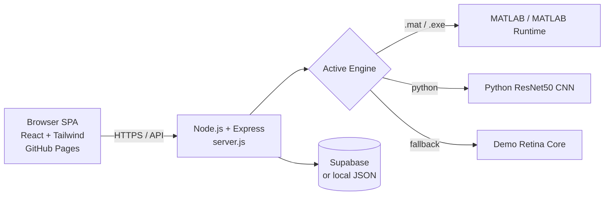

<div align="center">


# Calisto · OcuVision AI

### Premium Ophthalmic Intelligence — AI-powered retinal fundus screening in your browser

[](https://fahmiimrann.github.io/calisto.github.io/)
[](https://fahmiimrann.github.io/calisto.github.io/)


</div>

---

## Overview

**Calisto (OcuVision AI)** is a modern, web-based clinical screening tool that analyzes **retinal fundus images** and flags signs of common eye diseases in seconds. It pairs a polished, glassmorphic single-page dashboard with a real AI inference backend — supporting both a **MATLAB Bagged Trees** classifier and a **Python ResNet50 CNN**, with a built-in demo mode so the site stays usable anywhere.

The frontend runs entirely client-side on GitHub Pages; when connected to the OcuVision backend it performs genuine feature extraction (GLCM texture, intensity statistics, vessel morphology, optic-nerve-head cup-to-disc ratio) and disease classification.

> ⚠️ **Disclaimer:** Calisto is a research / final-year-project tool and is **not** a certified medical device. It is intended to assist screening workflows, not to replace a qualified ophthalmologist's diagnosis.

<div align="center">

### 👉 [Launch the live app](https://fahmiimrann.github.io/calisto.github.io/)

</div>

---

## ✨ Key Features

| | Module | What it does |
|---|---|---|
| 📊 | **Overview** | At-a-glance dashboard — scans today, anomalies detected, cases reviewed, and live AI-accuracy metrics. |
| 🔬 | **Diagnostics** | Upload a fundus image and run AI screening; per-scan engine picker (MATLAB / Python / Demo) with rich feature breakdowns. |
| 🗂️ | **Patient Registry** | Full CRUD on patient records with condition-coded IDs (`OCU-DR`, `OCU-G`, `OCU-AMD`, `OCU-H`) and password-protected edits/deletes. |
| 📈 | **Insights** | Analytics on case mix, age distribution, and gender split rendered with Chart.js. |
| ⚙️ | **Settings / AI Core** | Manage your staff account, link a local device, configure data privacy, and upload / activate AI models. |

---

## 🧠 Conditions Detected

| Condition | Severity tier | Record prefix |
|---|---|---|
| Diabetic Retinopathy | Critical / Alert | `OCU-DR` |
| Glaucoma (incl. early indicators) | Moderate–Critical | `OCU-G` |
| Age-related Macular Degeneration (AMD) | Moderate | `OCU-AMD` |
| Healthy / Normal | Optimal | `OCU-H` |

---

## 🤖 AI Engines

Calisto can route each scan to one of three interchangeable engines:

| Engine | Type | Notes |
|---|---|---|
| **MATLAB Bagged Trees** | `99_BaggedTreesModel.mat` | Full feature pipeline; runs via MATLAB or a licence-free compiled `.exe` + MATLAB Runtime. |
| **Python ResNet50 CNN** | `python_predict.py --engine cnn` | End-to-end deep-learning classifier. |
| **Demo Retina Core** | built-in | Deterministic baseline used as a fallback when no inference runtime is present — keeps the public site fully interactive. |

---

## 🏗️ Architecture



The browser app talks to the backend through `API_BASE_URL`. When no backend is reachable, it gracefully degrades to demo mode so the GitHub Pages site always works.

---

## 🛠️ Tech Stack

- **Frontend:** React 18 (via Babel standalone), Tailwind CSS, Chart.js, Font Awesome, Plus Jakarta Sans
- **Backend:** Node.js, Express, Multer (uploads), CORS, dotenv
- **AI:** MATLAB (Bagged Trees) / MATLAB Compiler Runtime, Python (ResNet50 CNN)
- **Data:** Supabase (recommended) or local JSON files (`data/users.json`, `data/records.json`)
- **Hosting:** GitHub Pages (frontend) + cloud VM / Cloudflare Tunnel (backend)

---

## 🚀 Getting Started (Local)

### Use the live app
No installation required — just open **[the live site](https://fahmiimrann.github.io/calisto.github.io/)**. It runs in demo mode out of the box.

### Run locally with the AI backend

```bash
# 1. Clone the repository
git clone https://github.com/fahmiimrann/calisto.github.io.git
cd calisto.github.io

# 2. Install backend dependencies
npm install

# 3. (Optional) configure your environment
#    Create a .env file – see the variables below.

# 4. Start the server
npm start
```

Then open **http://localhost:3000** to use the site against your local backend.

### Environment variables (`.env`)

```env
PORT=3000

# Storage — Supabase recommended for shared multi-user data
SUPABASE_URL=https://yourproject.supabase.co
SUPABASE_SERVICE_KEY=your-service-key

# AI runtime (pick one path)
# Licence-free compiled MATLAB executable:
# OCU_COMPILED_EXE=C:\path\to\dist\ocu_main.exe
# …or full MATLAB:
# MATLAB_EXEC=C:\Program Files\MATLAB\R2025b\bin\matlab.exe
```

Verify the backend at **http://localhost:3000/api/health**.

---

## 📡 API Reference (selected)

| Method | Endpoint | Description |
|---|---|---|
| `GET` | `/api/health` | Backend + runtime status |
| `POST` | `/api/analyze` | Run AI screening on an uploaded fundus image |
| `POST` | `/api/login` · `/api/register` · `/api/logout` | Authentication |
| `GET` `POST` `PATCH` `DELETE` | `/api/records` | Patient record CRUD (auth required) |
| `GET` `POST` | `/api/models` · `/api/models/select` | AI model registry |

---

## ☁️ Deployment

- **Frontend:** published automatically to **GitHub Pages** at the live URL above on every push to `main`.
- **Backend:** the Node + AI server runs on a separate always-on host (cloud VM / lab PC). The live frontend reaches it via the `TUNNEL_API_BASE_URL` value in `index.html`; when that's blank, the site falls back to the demo backend so it always works.

---

## 📁 Project Structure

```
calisto.github.io/
├── index.html            # Single-page React frontend (the whole UI)
├── server.js             # Express API + static file server
├── matlab-runner.js      # MATLAB / compiled-exe inference bridge
├── python-runner.js      # Python CNN inference bridge
├── db.js                 # Supabase / MySQL / local-JSON data layer
├── Calisto Logo.png      # Branding
├── Background_Video.mp4  # Login backdrop
└── package.json
```

---

## 🗺️ Roadmap

- [ ] Exportable PDF patient reports
- [ ] Multi-language UI
- [ ] Expanded condition coverage
- [ ] Role-based access control for clinics

---

## 📄 License

Released under the MIT License.

<div align="center">

Built with care for accessible eye-health screening · **[Open Calisto →](https://fahmiimrann.github.io/calisto.github.io/)**

</div>
