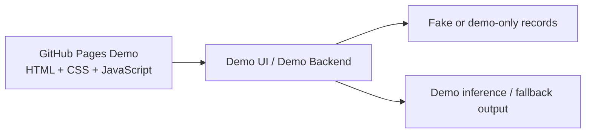
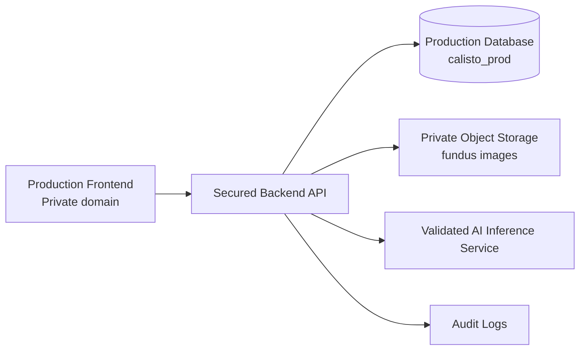

<div align="center">


# Calisto · OcuVision AI

### Public Demo · AI-assisted retinal fundus screening interface

> **Demo notice:** This public GitHub Pages version is for demonstration, portfolio, and academic observation only.  
> It must use demo/sample data only and must not be connected to the real production database, production backend, private storage, or real patient records.

---

## Public Demo Status

This repository powers the public demo site:

**Demo URL:** `https://fahmiimrann.github.io/calisto.github.io/`

The demo version is intended to show the user interface, workflow, and concept of OcuVision AI without exposing any real industry infrastructure.

| Area | Public GitHub Demo |
|---|---|
| Purpose | Demo / FYP / portfolio observation |
| Data | Fake/sample data only |
| Patient records | No real patient records |
| Database | Demo database or local/demo fallback only |
| Backend | Demo backend or local development backend only |
| AI engine | Demo/fallback inference or non-sensitive test model only |
| Production access | Not connected to production |
| Real clinic use | Not allowed |

---

## Production Separation

The real industry version is maintained separately from this public GitHub Pages demo.

| Area | Public Demo Version | Real Industry Version |
|---|---|---|
| URL | `https://fahmiimrann.github.io/calisto.github.io/` | Private production domain, for example `https://app.yourdomain.com` |
| Repository | Public demo repository | Private production repository |
| Backend | Demo/local backend only | Secured production backend |
| Database | `calisto_demo` or demo fallback | `calisto_prod` managed database |
| Storage | Demo/test storage only | Private secured object storage |
| Users | Demo/test accounts only | Approved staff accounts only |
| Patient data | Fake data only | Real records under controlled access |
| Access control | Demo-level | Production authentication, roles, audit logs |
| CORS | Demo domain only | Production domain only |

The GitHub Pages demo must never be allowed to call the production API or production database.

---

## Overview

Calisto, also known as OcuVision AI, is an AI-assisted retinal fundus screening interface designed to demonstrate how fundus image upload, preliminary screening output, patient record management, and analytics may be combined in a web-based clinical workflow.

This public repository is **not the production healthcare deployment**. It is a demo/reference version for public observation.

> **Medical disclaimer:** Calisto/OcuVision AI is a decision-support and screening aid prototype. It is not a certified or regulatory-cleared medical device. It must not be used as the sole basis for diagnosis or treatment. All findings require review and confirmation by a qualified healthcare professional.

---

## Key Features Demonstrated

| Module | What it demonstrates |
|---|---|
| Overview | Dashboard summary for scans, anomalies, reviewed cases, and AI-related metrics |
| Diagnostics | Fundus image upload and AI-assisted screening workflow |
| Patient Registry | Patient record CRUD workflow using condition-coded IDs such as `OCU-DR`, `OCU-G`, `OCU-AMD`, and `OCU-H` |
| Insights | Case mix, age distribution, and gender split visualised with charts |
| Settings / AI Core | Account settings and AI model management interface for demonstration |

---

## Conditions Demonstrated

| Condition | Demo severity tier | Record prefix |
|---|---|---|
| Diabetic Retinopathy | Critical / Alert | `OCU-DR` |
| Glaucoma | Moderate–Critical | `OCU-G` |
| Age-related Macular Degeneration | Moderate | `OCU-AMD` |
| Healthy / Normal | Optimal | `OCU-H` |

---

## AI Engine Modes

The codebase may support multiple engine modes depending on local or private deployment configuration.

| Engine | Intended use |
|---|---|
| Demo Retina Core | Public demo fallback / safe demonstration |
| MATLAB Bagged Trees | Local development or controlled testing |
| Python CNN / ResNet-style model | Private production or validated staging only |

The public GitHub Pages demo should use only safe demo mode or a non-sensitive test backend. The production AI backend, trained weights, private model files, and production inference API must not be exposed through this public repository.

---

## Architecture

### Public Demo Architecture



### Real Industry Architecture

The real industry version should be deployed separately:



The public GitHub demo and the production system must use different domains, different environment variables, different database users, and different databases.

---

## Tech Stack

| Layer | Demo / Development |
|---|---|
| Frontend | React 18 via Babel standalone, Tailwind CSS, Chart.js, Font Awesome |
| Backend | Node.js, Express, Multer, CORS, dotenv |
| Data layer | MySQL, Supabase, or local JSON fallback depending on environment |
| AI integration | Demo engine, MATLAB runner, or Python runner depending on environment |
| Demo hosting | GitHub Pages frontend |

Production deployments should use private backend hosting, managed database, private object storage, HTTPS, audit logging, and role-based access control.

---

## Security Position

This public repository is safe for observation only when configured as a demo.

### Public demo rules

- Do not store real patient records.
- Do not upload real fundus images.
- Do not commit `.env` files.
- Do not commit production database credentials.
- Do not commit production API keys.
- Do not expose production backend URLs in public frontend code.
- Do not allow the GitHub Pages demo origin to access the production backend.
- Use fake/sample records only.

### Production rules

A real industry deployment must be separated from this public repository and should include:

- Private production repository
- Production-only backend domain
- Managed production database such as `calisto_prod`
- Separate database user with limited privileges
- Private image/object storage
- HTTPS only
- Role-based access control
- Protected model management endpoints
- Disabled public registration
- Audit logs for sensitive actions
- Backup and restore process
- Privacy notice, patient consent, AI disclaimer, and data retention policy

---

## Environment Separation

### Demo environment example

```env
NODE_ENV=demo
DB_BACKEND=mysql
MYSQL_DATABASE=calisto_demo
ENABLE_SEED_DATA=true
ALLOWED_ORIGINS=https://fahmiimrann.github.io
```

### Production environment example

```env
NODE_ENV=production
DB_BACKEND=mysql
MYSQL_DATABASE=calisto_prod
ENABLE_SEED_DATA=false
DISABLE_PUBLIC_REGISTRATION=true
ALLOWED_ORIGINS=https://app.yourdomain.com
```

The production `.env` file must never be committed to GitHub.

Use `.env.example` for placeholders only.

---

## Recommended `.gitignore`

```gitignore
.env
.env.local
.env.production
.env.demo
node_modules
data
uploaded-models
models
*.pem
*.key
```

---

## Local Development

```bash
git clone https://github.com/fahmiimrann/calisto.github.io.git
cd calisto.github.io
npm install
npm install mysql2
npm start
```

Then open:

```text
http://localhost:3000
```

For local production-style testing, use a local or managed MySQL database such as `calisto_prod`, but do not expose it to the public demo.

---

## API Reference

Selected backend endpoints may include:

| Method | Endpoint | Purpose |
|---|---|---|
| `GET` | `/api/health` | Backend/runtime status |
| `POST` | `/api/login` | User login |
| `POST` | `/api/register` | Registration, should be disabled in production |
| `POST` | `/api/analyze` | Fundus image screening, should require authentication |
| `GET/POST/PATCH/DELETE` | `/api/records` | Patient record CRUD, should require authentication |
| `GET/POST` | `/api/models` | AI model registry, should be admin-only |
| `POST` | `/api/models/select` | Select active model, should be admin-only |

---

## Deployment Guidance

### Public demo deployment

The public GitHub Pages deployment should remain demo-only.

```text
GitHub Pages → demo UI → fake/demo data only
```

### Real industry deployment

The real industry version should be deployed separately.

```text
Private frontend domain
+ secured backend API
+ managed production database
+ private object storage
+ validated AI service
+ audit logging
```

Recommended production separation:

```text
Public GitHub demo:
https://fahmiimrann.github.io/calisto.github.io/

Production:
https://app.yourdomain.com
```

Do not point the GitHub Pages demo to the production API.

---

## Project Structure

```text
calisto.github.io/
├── index.html            # Single-page frontend
├── server.js             # Express API + static file server
├── matlab-runner.js      # MATLAB / compiled-exe inference bridge
├── python-runner.js      # Python inference bridge
├── db.js                 # MySQL / Supabase / local-JSON data layer
├── models/               # Trained weights - should be gitignored
├── Calisto Logo.png      # Branding
├── Background_Video.mp4  # Login backdrop
└── package.json
```

---

## Roadmap

- Separate demo and production environments completely
- Add full role-based access control
- Protect model upload and model selection as admin-only
- Add audit logging for login, upload, diagnosis, record view/edit/delete, export, and model changes
- Move production images to private object storage
- Add exportable PDF patient reports
- Add privacy notice and patient consent workflow
- Add model validation report with accuracy, sensitivity, specificity, precision, recall, F1-score, and confusion matrix

---

## License

Released under the MIT License.

Built for AI-assisted eye-health screening workflow demonstration.


<div align="center">

Built with care for accessible eye-health screening · **[Open Calisto →](https://fahmiimrann.github.io/calisto.github.io/)**

</div>
